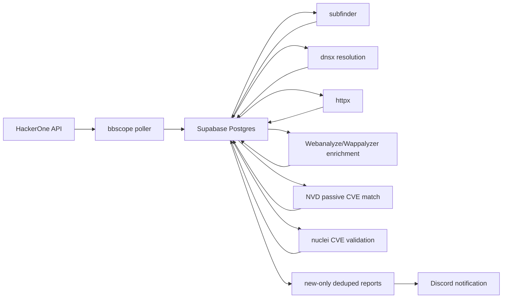

# Architecture

Zero is a scheduled pipeline with a Postgres/Supabase state store.

## Components

- `cmd/zero`: CLI entrypoint.
- `internal/scope`: scope source adapters. The first adapter imports HackerOne via `github.com/sw33tLie/bbscope/v2/pkg/platforms/hackerone`.
- `internal/enumeration`: external enumeration tools such as `subfinder`.
- `internal/probe`: DNS resolution and live checks, currently `dnsx` and `httpx`.
- `internal/enrich`: heavier target-intelligence enrichment, currently Webanalyze/Wappalyzer definitions.
- `internal/db`: Supabase/Postgres repository and migrations.
- `docs`: operator design, integration notes, and roadmap.

## Data Model

- `zero_programs`: platform program identity.
- `zero_scope_assets`: raw and normalized in/out-of-scope assets.
- `zero_subdomains`: discovered hostnames from domain/wildcard scope.
- `zero_http_services`: alive URLs and httpx fingerprint data.
- `zero_technology_observations`: normalized technology observations from tools.
- `zero_vulnerability_records`: CVE/KEV/advisory/template records.
- `zero_technology_vulnerability_matches`: program-scoped passive links from a technology/version observation to a vulnerability record, with confidence and evidence.
- `zero_nuclei_results`: active validation hits from Nuclei, deduped by program/template/match/evidence.
- `zero_candidate_findings`: deduplicated candidate matches.
- `zero_change_events`: append-only record of added/updated/removed entities. New scope assets, subdomains, services, technologies, Nuclei hits, and candidate findings emit deduped change events.
- `zero_scan_runs`: execution history, counts, status, and per-run stats.
- `zero_scan_requests`: queued manual/scheduled custom scan requests.
- `zero_reports`: generated report artifacts.

Every discovered entity is linked back to `zero_programs`. This is required because the same hostname can appear in more than one program and because notifications/reports must be scoped to the bug bounty target, not just a raw URL.

Entities produced by a task also carry `last_scan_run_id` or `scan_run_id` where the schema supports it. Change events use the same scan id, which lets the API answer what changed in a specific execution without guessing from timestamps.

## Execution Model

Zero scans multiple programs concurrently through `zero run due`, starting with `ZERO_TARGET_PARALLELISM=12`. A program is due when it is active and its `last_scan_finished_at` is missing or older than `scan_interval_hours`. Inside each program, external tools use moderate defaults and batching:

- Scope sync writes in batches on first import and uses unique constraints for deduplication.
- Scope sync defaults to bounty programs only. Assets without bounty eligibility are stored as out-of-scope even when the source lists them as in-scope.
- Enumeration accepts only sanitized, valid, in-scope wildcard assets linked to the program. For `*.example.com`, `subfinder` receives `example.com`.
- Discovered names are accepted only when they match the wildcard regex for that scope asset. The apex (`example.com`) is not accepted as a wildcard discovery unless it is also present as an exact `domain` or `url` asset.
- Active out-of-scope `domain`, `url`, and `wildcard` assets override broad in-scope wildcards during enumeration and probing.
- `httpx` probes two target classes: discovered wildcard subdomains and exact `domain`/`url` scope hosts. Exact scope hosts are not expanded into roots.
- `dnsx` runs before `httpx` for discovered wildcard subdomains and records `resolves`; unresolved wildcard discoveries are skipped by `httpx` unless they later resolve again.
- `httpx` stores target intel for alive services and technology observations.
- `webanalyze` runs after `httpx` against alive services and stores broader Wappalyzer-style technology observations, including versions when detectable. Operators can provide a custom technologies file per manual run without changing global worker configuration.
- `analyze cves` queries NVD for versioned technology observations, prefers CPE/range evidence where available, falls back to keyword evidence, and stores service-linked CVE matches as passive intelligence.
- `nuclei` runs after probing/enrichment and only against alive URLs; by default it derives `-id CVE-...` template IDs from medium/high/critical passive matches. Operators can override this with explicit template IDs or the broader tag policy.
- `report generate` creates confirmed Nuclei-backed reports and also promotes medium/high/critical passive CVE matches to potential/unconfirmed report entries when no Nuclei result confirms that CVE on the same service. Passive reports include the Nuclei validation reason, such as no local template or no confirming result.
- Newly inserted entities write stable `zero_change_events` rows so operators and API clients can inspect what changed without replaying old observations.
- Report generation emits only new, unreported findings and attaches a stable `report_id` for deduplication.
- Discord notification delivery reads new reports, stores delivery state in `zero_discord_notifications`, and never sends a report twice after a successful send.
- At the end of a due-program run, entities older than `ZERO_STALE_AFTER_HOURS` are marked inactive/removed with change events. The default is 168 hours, which gives a 72-hour cadence more than two missed cycles before stale cleanup.

## Scheduler

The worker uses second-enabled cron expressions:

- `ZERO_SCHEDULE_FULL`
- `ZERO_SCHEDULE_SCOPE_SYNC`
- `ZERO_SCHEDULE_ENUM`
- `ZERO_SCHEDULE_PROBE`
- `ZERO_SCHEDULE_CVE`
- `ZERO_SCHEDULE_NUCLEI`

The primary worker job is the due-program pipeline scheduled by `ZERO_SCHEDULE_FULL`: global scope sync first, then per-program enumeration, DNS resolution, probing, Webanalyze enrichment, passive CVE matching, Nuclei validation, report generation, and Discord notification for due programs only. The `httpx` and Webanalyze fingerprint phases are target intel. Passive CVE matching is reported with lower confidence as potential/unconfirmed when Nuclei has no confirming hit, while Nuclei-backed findings remain the higher-confidence validation path.

Manual runs use `zero run manual` and accept one-off limits, custom Webanalyze apps files, CVE-derived Nuclei template selection, and explicit Nuclei template IDs. These flags apply only to that execution and do not modify environment defaults or worker cadence.

Scheduled custom runs use `zero run schedule`, persist the same manual-run parameters in `zero_scan_requests`, and are claimed by the worker every 30 seconds with row locking. This lets an operator queue targeted Webanalyze/Nuclei experiments without changing the normal due-program cadence.
