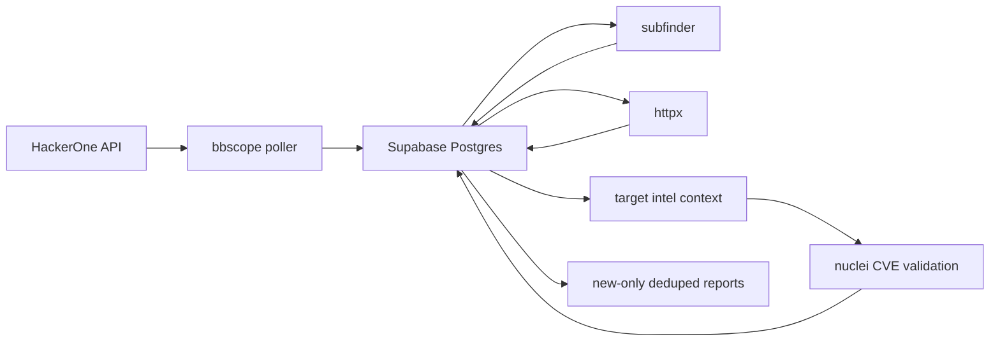

# Architecture

Zero is a scheduled pipeline with a Postgres/Supabase state store.

## Components

- `cmd/zero`: CLI entrypoint.
- `internal/scope`: scope source adapters. The first adapter imports HackerOne via `github.com/sw33tLie/bbscope/v2/pkg/platforms/hackerone`.
- `internal/enumeration`: external enumeration tools such as `subfinder`.
- `internal/probe`: live checks and fingerprinting, currently `httpx`.
- `internal/db`: Supabase/Postgres repository and migrations.
- `docs`: operator design, integration notes, and roadmap.

## Data Model

- `zero_programs`: platform program identity.
- `zero_scope_assets`: raw and normalized in/out-of-scope assets.
- `zero_subdomains`: discovered hostnames from domain/wildcard scope.
- `zero_http_services`: alive URLs and httpx fingerprint data.
- `zero_technology_observations`: normalized technology observations from tools.
- `zero_vulnerability_records`: CVE/KEV/advisory/template records.
- `zero_nuclei_results`: active validation hits from Nuclei, deduped by program/template/match/evidence.
- `zero_candidate_findings`: deduplicated candidate matches.
- `zero_change_events`: append-only record of added/updated/removed entities per scan.
- `zero_scan_runs`: execution history, counts, status, and per-run stats.
- `zero_reports`: generated report artifacts.

Every discovered entity is linked back to `zero_programs`. This is required because the same hostname can appear in more than one program and because notifications/reports must be scoped to the bug bounty target, not just a raw URL.

## Execution Model

Zero should scan multiple programs concurrently, starting with `ZERO_TARGET_PARALLELISM=4`. Inside each program, external tools should use moderate defaults and batching:

- Scope sync writes in batches on first import and uses unique constraints for deduplication.
- Enumeration accepts only sanitized, valid, in-scope wildcard assets linked to the program. For `*.example.com`, `subfinder` receives `example.com`.
- Discovered names are accepted only when they match the wildcard regex for that scope asset. The apex (`example.com`) is not accepted as a wildcard discovery unless it is also present as an exact `domain` or `url` asset.
- Active out-of-scope `domain`, `url`, and `wildcard` assets override broad in-scope wildcards during enumeration and probing.
- `httpx` probes two target classes: discovered wildcard subdomains and exact `domain`/`url` scope hosts. Exact scope hosts are not expanded into roots.
- `httpx` stores target intel for alive services and technology observations.
- `nuclei` runs after probing and only against alive URLs; it is the CVE validation source.
- Report generation emits only new, unreported findings and attaches a stable `report_id` for deduplication.

## Scheduler

The worker uses second-enabled cron expressions:

- `ZERO_SCHEDULE_FULL`
- `ZERO_SCHEDULE_SCOPE_SYNC`
- `ZERO_SCHEDULE_ENUM`
- `ZERO_SCHEDULE_PROBE`
- `ZERO_SCHEDULE_CVE`
- `ZERO_SCHEDULE_NUCLEI`

The primary worker job is the full pipeline scheduled by `ZERO_SCHEDULE_FULL`: scope sync before enumeration, enumeration before probing, Nuclei validation after probing, and report generation after Nuclei. The `httpx` fingerprint phase is target intel only; passive CVE matching is intentionally disabled to avoid noisy unvalidated reports.
