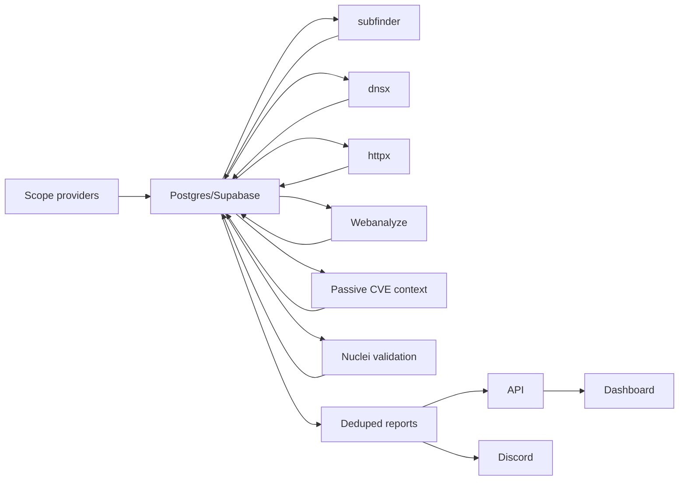

# Architecture

Zero is a stateful pipeline. Every scan step reads from and writes to Postgres so runs can be deduplicated, resumed, inspected, and reported.



## Main Services

- `zero`: the continuous worker and CLI.
- `api`: read API for dashboards, integrations, and operators.
- `dashboard`: local UI that proxies API reads without exposing backend secrets to the browser.
- `migrate`: one-shot migration service used with the Compose `tools` profile.

## Core Tables

- `zero_programs`: bug bounty programs and scan cadence.
- `zero_scope_assets`: in-scope and out-of-scope assets.
- `zero_subdomains`: discovered hostnames.
- `zero_http_services`: alive URLs and `httpx` fingerprints.
- `zero_technology_observations`: technology names, versions, and sources.
- `zero_vulnerability_records`: CVE/advisory/template records.
- `zero_technology_vulnerability_matches`: passive CVE context linked to technologies.
- `zero_nuclei_results`: active validation output.
- `zero_candidate_findings`: deduplicated finding candidates.
- `zero_scan_runs`: execution history for individual steps.
- `zero_scan_requests` and `zero_scan_campaigns`: durable custom scan work.
- `zero_reports`: generated report artifacts.

Every asset and result is linked back to a program. This matters because the same hostname can appear in multiple programs with different scope rules.

## Execution Model

Continuous runs scan due programs based on `scan_interval_hours`. Custom campaigns create durable scan requests and are consumed by a worker pool. The pool keeps slots full while respecting campaign-level and global parallelism limits.

The default per-program flow is:

```text
scope-safe enumeration -> DNS resolution -> HTTP probing -> technology enrichment -> passive CVE context -> Nuclei validation -> report -> notify
```

`httpx` and Webanalyze provide target intelligence. Passive CVE matches provide prioritization context. Nuclei provides active validation when a relevant template is selected.

## Recovery

On startup, the worker:

1. marks interrupted scan runs with recovery metadata;
2. requeues interrupted custom scan requests;
3. refreshes campaign counters;
4. resumes normal scheduled work.

Completed child requests stay completed, so campaigns survive container restarts without starting from scratch.
